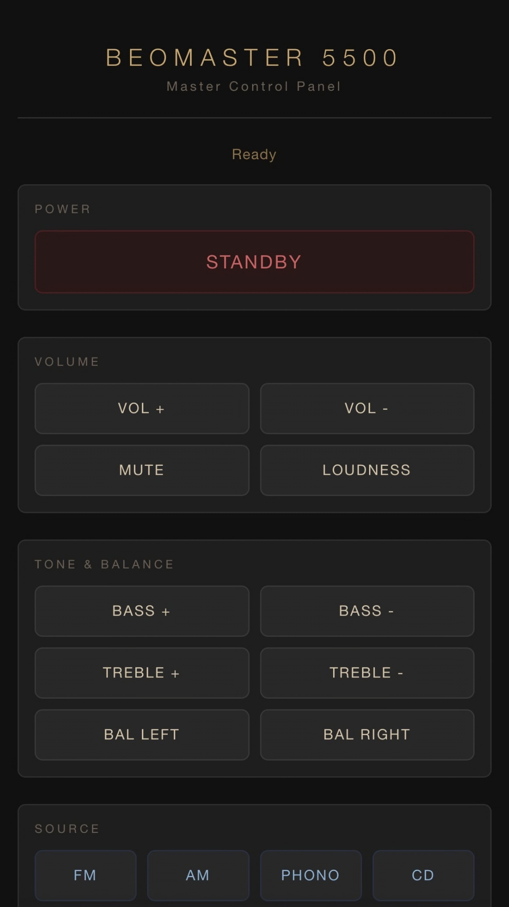
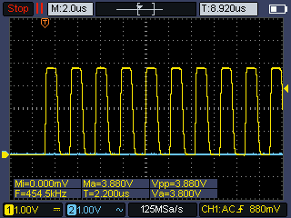

# Beomaster 5500 — ESP32 IR Web Controller


### Author Note 
This is an entirely vibe coded project. I wanted to build something quick and easy to control a B&O 5500 hifi from the 80s. The idea was to install a small esp32 module with an IR transmitter in close proximity to the hifi so that we can control the device from any room in the house. 

### Current Status:
20/03/2026 - IR transmitter verified on oscilloscope: clean 455 kHz carrier at 25% duty cycle, correct pulse-distance encoding confirmed. Settings page added — IR codes now configurable via browser without re-flashing. OLED display added showing device status and IP address. Awaiting first live test against the Beomaster 5500.

05/03/2026 - Codebase builds and flashes to XIAO_ESP32C3 successfully. GUI looks close enough to B&O hardware for now.

### Description: 

A Wi-Fi-hosted remote control for the Bang & Olufsen Beomaster 5500, built on an ESP32. The device serves a web page that replicates the MCP 5500 Master Control Panel, sending B&O Legacy IR commands when buttons are tapped.


---

## Table of Contents

1. [Project Overview](#project-overview)
2. [Hardware](#hardware)
3. [IR Transmitter Circuit](#ir-transmitter-circuit)
4. [Wiring Summary](#wiring-summary)
5. [B&O Legacy IR Protocol](#bo-legacy-ir-protocol)
6. [Command Code Reference](#command-code-reference)
7. [Software Setup](#software-setup)
8. [Build Stages](#build-stages)
9. [Calibrating / Learning Unknown Codes](#calibrating--learning-unknown-codes)
10. [Troubleshooting](#troubleshooting)
11. [Modification Notes](#modification-notes)

---

## Project Overview

| Item | Detail |
|---|---|
| Target device | Bang & Olufsen Beomaster 5500 (c. 1986–1988) |
| Controller | ESP32 (any 38-pin or 30-pin DevKit module) |
| Interface | Browser-based web page, responsive for phone/tablet |
| IR protocol | B&O Legacy — 455 kHz carrier, space-encoded, 8-bit commands |
| Power | USB 5 V via ESP32 micro-USB / USB-C port |

---

## Hardware

### Bill of Materials

| Qty | Part | Notes |
|---|---|---|
| 1 | ESP32 DevKit (38-pin) | e.g. ESP32-WROOM-32 |
| 1 | IR LED 940 nm | TSAL6200 or equivalent, 940 nm |
| 1 | 2N2222 or BC547 NPN transistor | IR LED driver |
| 1 | 33 Ω resistor | IR LED current-limit (see calculation below) |
| 1 | 330 Ω resistor | Base resistor for transistor (sized for 455 kHz switching) |
| 1 | 0.96" I2C OLED display (SSD1306) | Status display — shows IP address and IR activity |
| 1 | 100 µF electrolytic capacitor | Power rail decoupling on 3V3 |
| 1 | 100 nF ceramic capacitor | High-frequency decoupling |
| 1 | Micro-USB cable + 5 V adapter | Power supply |
| — | Breadboard or PCB | For prototyping |
| — | Jumper wires | — |

### IR LED Current Calculation

Supply = 3.3 V (ESP32 GPIO via transistor collector from 3V3 pin)
LED forward voltage (Vf) ≈ 1.2 V
Target current: 100 mA peak (pulsed, not continuous — safe for typical IR LEDs)

```
R = (Vcc - Vf) / I = (3.3 - 1.2) / 0.100 = 21 Ω  → use 33 Ω (next standard value, ~63 mA)
```

For greater range (if using a transistor that can handle it) you can drop to 22 Ω for ~95 mA.
Check your specific IR LED datasheet for maximum peak current.

---

## IR Transmitter Circuit

```
ESP32 GPIO 4 (IR_TX_PIN)
        │
       [330Ω]         ← base resistor (sized for 455 kHz switching)
        │
        ├──► Base  of 2N2222
              │
        Collector ── [33Ω] ── Anode of IR LED
                               │
                             Cathode of IR LED
                               │
        Emitter ────────────── GND

3V3 pin ─────────────────────── Collector power rail
```

**In plain words:**
1. GPIO 4 → 330 Ω resistor → Base of 2N2222
2. 2N2222 Emitter → GND
3. 2N2222 Collector → 33 Ω resistor → IR LED anode
4. IR LED cathode → GND
5. The 33 Ω + LED are powered from the ESP32 **3V3** pin (not 5 V), keeping the collector supply at 3.3 V.

> **Why 330 Ω base resistor?** The 455 kHz carrier requires the transistor to switch in ~2.2 µs cycles. A 330 Ω base resistor gives a rise time of ~15 ns — fast enough for clean switching. The original 1 kΩ value works at 40 kHz but distorts the waveform at 455 kHz.

> **Why a transistor?** The ESP32 GPIO can only source ~12 mA safely. The transistor amplifies this to drive the IR LED at ~60–100 mA for adequate range (typically 3–8 metres line-of-sight).

### Optional: Boost range with a lens

Slip a short IR-transparent plastic tube over the LED to collimate the beam, or use a high-efficiency LED (e.g. Vishay VSLY3940) for extra reach.

---

## Wiring Summary

| ESP32 Pin | Connects To | Purpose |
|---|---|---|
| GPIO 4 | 330 Ω → 2N2222 Base | IR carrier output (455 kHz LEDC) |
| 3V3 | 33 Ω → IR LED anode | IR LED supply |
| GND | 2N2222 Emitter + IR LED cathode | Common ground |
| GPIO 21 (SDA) | OLED SDA | I2C data |
| GPIO 22 (SCL) | OLED SCL | I2C clock |
| — | 100 µF cap across 3V3–GND | Power decoupling |
| — | 100 nF cap across 3V3–GND | HF decoupling |

**To change the GPIO pin:** edit `IR_TX_PIN` in `ir_transmitter.h`.

---

## B&O Legacy IR Protocol

The Beomaster 5500 pre-dates the Beo4 remote and uses the original Bang & Olufsen IR protocol.

| Parameter | Value |
|---|---|
| Carrier frequency | 455 kHz |
| Carrier duty cycle | 25 % |
| Bit encoding | Space-encoded (pulse-distance) |
| Command length | 8 bits, MSB first |
| Pulse width | 200 µs (all bits and header) |
| Space for logic '0' | 3125 µs |
| Space for logic '1' | 6250 µs |
| Header space | 3125 µs (same as '0') |
| Inter-frame gap | ≥ 25 ms |
| Default repeat count | 3 frames per button press |

### Timing diagram (single frame)

```
Header           Bit 7 (MSB)                 Bit 0 (LSB)       Trailing
│← 200µs →│← 3125µs →│← 200µs →│← 3125 or 6250µs →│ ... │← 200µs →│← gap ≥25ms →│
  MARK        SPACE       MARK         SPACE (0 or 1)           MARK       SPACE
```

### Oscilloscope verification

455 kHz carrier confirmed on scope — clean square wave at 25 % duty cycle, with correct 3.125 ms / 6.25 ms spaces encoding 0 and 1 bits respectively.



### ESP32 implementation

The ESP32 LEDC peripheral generates the 455 kHz carrier on `IR_TX_PIN` using 2-bit resolution (`ledcAttach(pin, 455000, 2)`). `ledcWrite(pin, 1)` enables the carrier (25 % duty); `ledcWrite(pin, 0)` turns it off. `delayMicroseconds()` controls pulse and space durations.

> **ESP32 Arduino core v3 note:** The older `ledcSetup()` + `ledcAttachPin()` API was removed in core v3. Use `ledcAttach(pin, freq, resolution)` and pass the pin (not channel number) to `ledcWrite()`.

---

## Command Code Reference

All codes are 8-bit hexadecimal values. Pass the **decimal** equivalent as `?code=` in the HTTP request.

> **Important:** These codes are sourced from LIRC IR databases and B&O community documentation. Some (particularly tone controls) may require verification against your specific unit. See [Calibrating / Learning Unknown Codes](#calibrating--learning-unknown-codes).

### Power

| Function | Hex | Decimal |
|---|---|---|
| Standby / On | 0x0C | 12 |

### Volume

| Function | Hex | Decimal |
|---|---|---|
| Volume Up | 0x60 | 96 |
| Volume Down | 0x64 | 100 |
| Mute | 0x0D | 13 |
| Loudness | 0x3C | 60 |

### Source Selection

| Function | Hex | Decimal |
|---|---|---|
| FM | 0x81 | 129 |
| AM | 0x82 | 130 |
| Phono | 0x83 | 131 |
| CD | 0x92 | 146 |
| Tape 1 | 0x87 | 135 |
| Tape 2 | 0x88 | 136 |
| Aux / Video | 0x8A | 138 |

### Tuner

| Function | Hex | Decimal |
|---|---|---|
| Preset Up | 0x1E | 30 |
| Preset Down | 0x1F | 31 |
| Tune Up (manual) | 0x1C | 28 |
| Tune Down (manual) | 0x1D | 29 |
| Store Preset | 0x5C | 92 |

### Tone (verify these)

| Function | Hex | Decimal |
|---|---|---|
| Bass Up | 0x70 | 112 |
| Bass Down | 0x74 | 116 |
| Treble Up | 0x78 | 120 |
| Treble Down | 0x7C | 124 |

### Balance (verify these)

| Function | Hex | Decimal |
|---|---|---|
| Balance Left | 0x68 | 104 |
| Balance Right | 0x6C | 108 |

### Timer / Clock

| Function | Hex | Decimal |
|---|---|---|
| Timer | 0x44 | 68 |
| Clock | 0x43 | 67 |
| Sleep | 0x45 | 69 |

### Tape Transport

| Function | Hex | Decimal |
|---|---|---|
| Play | 0x35 | 53 |
| Stop | 0x36 | 54 |
| Record | 0x37 | 55 |

### Numeric (preset entry)

| Key | Hex | Decimal |
|---|---|---|
| 0 | 0x20 | 32 |
| 1 | 0x21 | 33 |
| 2 | 0x22 | 34 |
| 3 | 0x23 | 35 |
| 4 | 0x24 | 36 |
| 5 | 0x25 | 37 |
| 6 | 0x26 | 38 |
| 7 | 0x27 | 39 |
| 8 | 0x28 | 40 |
| 9 | 0x29 | 41 |

---

## Software Setup

### Arduino IDE Prerequisites

1. Install **Arduino IDE** (2.x recommended).
2. Add ESP32 board support:
   File → Preferences → Additional Boards Manager URLs:
   ```
   https://raw.githubusercontent.com/espressif/arduino-esp32/gh-pages/package_esp32_index.json
   ```
   Then: Tools → Board → Boards Manager → search "esp32" → install **esp32 by Espressif Systems**.
3. Install the **Adafruit SSD1306** library (for the OLED display):
   Sketch → Include Library → Manage Libraries → search "Adafruit SSD1306" → install.
   Also install **Adafruit GFX Library** when prompted as a dependency.

### Configuration

Edit **`BEOMaster.ino`**:
```cpp
const char* WIFI_SSID     = "YOUR_SSID";
const char* WIFI_PASSWORD = "YOUR_PASSWORD";
```

Edit **`ir_transmitter.h`** when hardware is ready:
```cpp
#define IR_TX_PIN        4    // Change if you use a different GPIO
#define IR_CIRCUIT_READY 0    // Change to 1 once circuit is wired
```

### Upload & Test

1. Select board: **ESP32 Dev Module** (or your specific variant).
2. Select the correct COM port.
3. Upload.
4. Open Serial Monitor at **115200 baud**.
5. The IP address is printed on successful Wi-Fi connection.
6. Navigate to `http://<ip-address>/` in a browser on the same network.

---

## Build Stages

### Stage 1 — Software only (current)

- `IR_CIRCUIT_READY 0`
- All button presses log to Serial: `[IR] Sending B&O command: 0xXX (STUB)`
- Confirms web UI, Wi-Fi, and routing work before touching hardware.

### Stage 2 — Build IR circuit

- Assemble the transistor + LED circuit on breadboard per the schematic above.
- Connect GPIO 4 to the base resistor.
- Set `IR_CIRCUIT_READY 1` in `ir_transmitter.h`.
- Re-upload and point the LED at the Beomaster.

### Stage 3 — Verify codes

- Test each button in turn.
- Use an IR receiver (TSOP38238 on a spare GPIO) and the learning sketch to compare received codes against transmitted ones if any commands fail.
- Update `beo_commands.h` with corrected values.

### Stage 4 — Permanent installation (optional)

- Mount ESP32 + circuit on a small PCB or in a 3D-printed enclosure.
- Power from a USB wall adapter or the Beomaster's auxiliary DC output if available.
- Optionally set a static IP or register the hostname with your router.

---

## Calibrating / Learning Unknown Codes

If a button has no effect, the code may be wrong. Use this method to learn the correct code:

### Equipment needed

- Original MCP 5500 remote (or Beo4 if compatible)
- IR receiver module: the Beomaster uses a 455 kHz carrier — a standard 38/40 kHz TSOP receiver will not work. Use a wideband receiver or demodulate the raw signal with a photodiode + transimpedance amplifier connected to a GPIO
- Any Arduino / ESP32 with a simple IR-receive sketch (e.g. IRremote library's `IRrecvDump` example)

### Procedure

1. Wire the IR receiver: VCC → 3V3, GND → GND, OUT → any GPIO (e.g. GPIO 15).
2. Upload the `IRrecvDump` example from the IRremote library.
3. Point the original remote at the receiver and press each button.
4. Note the raw timing data — convert to hex and update `beo_commands.h`.
5. Test by sending the learned code with the ESP32 transmitter.

---

## Troubleshooting

| Symptom | Likely Cause | Fix |
|---|---|---|
| Page doesn't load | Wrong IP / not connected | Check Serial Monitor for IP; ensure same Wi-Fi network |
| "No response" in browser | HTTP request fails | Check Wi-Fi; try increasing server timeout |
| Beomaster ignores commands | Wrong IR code | Use IR learning procedure above |
| Short range | LED current too low | Reduce series resistor; check transistor connections |
| Distorted carrier waveform | Base resistor too high for 455 kHz | Use 330 Ω base resistor, not 1 kΩ |
| Carrier duty cycle wrong | LEDC resolution mismatch | Verify `ledcAttach(pin, 455000, 2)` and `ledcWrite(pin, 1)` |
| Erratic operation | Power supply noise | Add/check decoupling capacitors |
| Won't compile | Missing board support | Install esp32 by Espressif in Boards Manager |
| `ledcSetup` not found | Removed in ESP32 core v3 | Replace with `ledcAttach(pin, freq, res)` — see ir_transmitter.h |
| OLED blank | Wrong I2C address | Try `0x3C` or `0x3D` in oled_display.h |

---

## Modification Notes

### Adding new buttons

1. Add a `constexpr uint8_t BEO_CMD_*` entry in `beo_commands.h`.
2. Add the button to the `buttons[]` array in `BEOMaster.ino` with key, default code, and label.
3. Add the button entry to `SECTIONS` in `settings_ui.h` so it appears on the settings page.
4. Add a `<button onclick="send('key', default_decimal)">LABEL</button>` in `web_ui.h`.

### Reconfiguring IR codes without re-flashing

Navigate to `http://<ip-address>/settings` in a browser. Each button's hex code can be edited and saved directly to the ESP32's flash. Changes survive reboots. Use **Reset Defaults** to restore factory codes.

### Changing Wi-Fi to Access Point mode

Replace the `WiFi.begin()` block in `BEOMaster.ino` with:
```cpp
WiFi.softAP("Beomaster5500", "beo1234");
Serial.println(WiFi.softAPIP());
```
The ESP32 will create its own Wi-Fi hotspot — useful if you don't want it on your home network.

### OTA (Over-the-Air) updates

Add the `ArduinoOTA` library to `setup()` so you can re-flash without USB after the unit is installed. See the ESP32 Arduino OTA example.

### mDNS hostname

Add `#include <ESPmDNS.h>` and `MDNS.begin("beomaster");` in `setup()` so you can access the page at `http://beomaster.local/` instead of an IP address.

### Repeat count

Adjust the `repeats` parameter in `ir_send_beo()` calls (default 3) if the Beomaster misses commands or registers them multiple times.

---

*Protocol timings based on LIRC B&O database and community reverse-engineering. Command codes should be verified against your specific Beomaster 5500 unit.*
